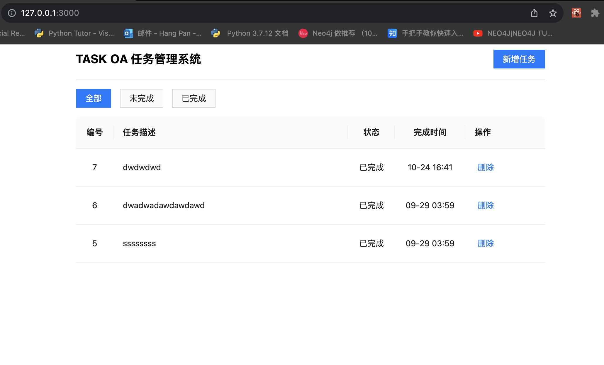
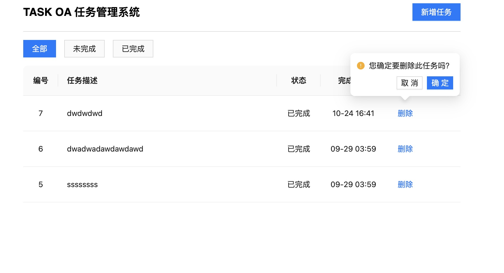
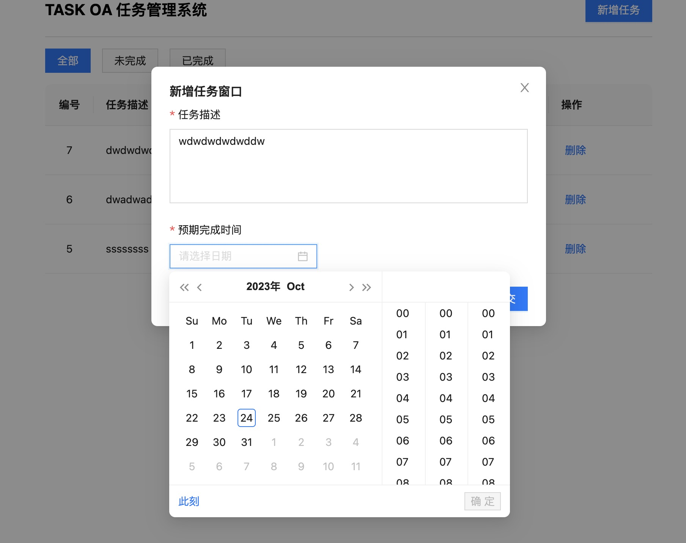
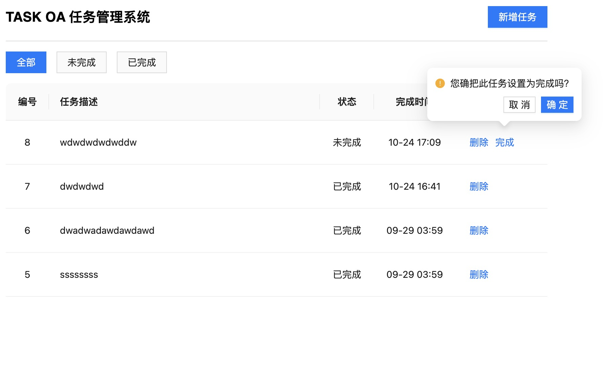

## Installation
First,you must have nodejs enviroment   
second, run ```npm i``` to install the dependencies    
then, run ` npm start` 





## Descrption(Frontend)
Use React ,less and Antd UI to do the frontend  
And use react-redux to complete the state management  

## For backend 
Use express framework and json file as db  
please move to here https://github.com/Russellyyds/TASKOA_BACKEND
